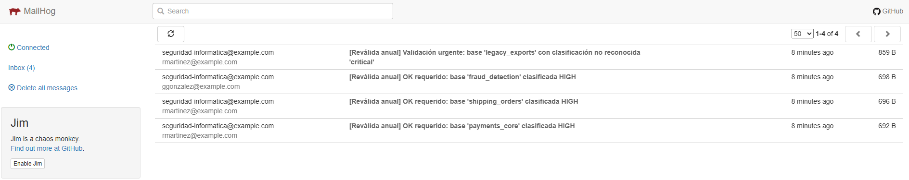
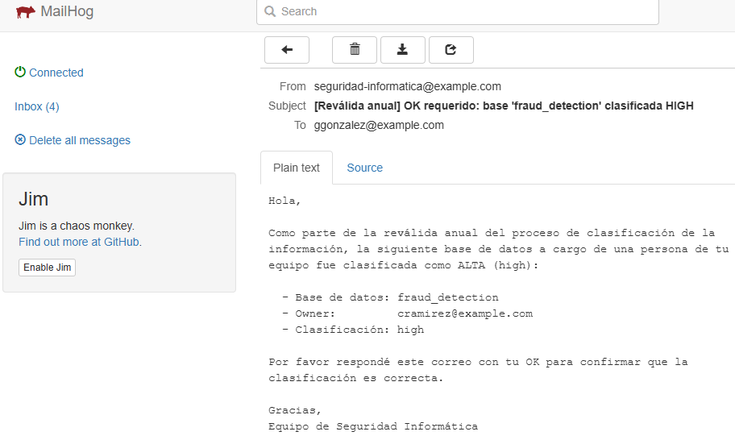
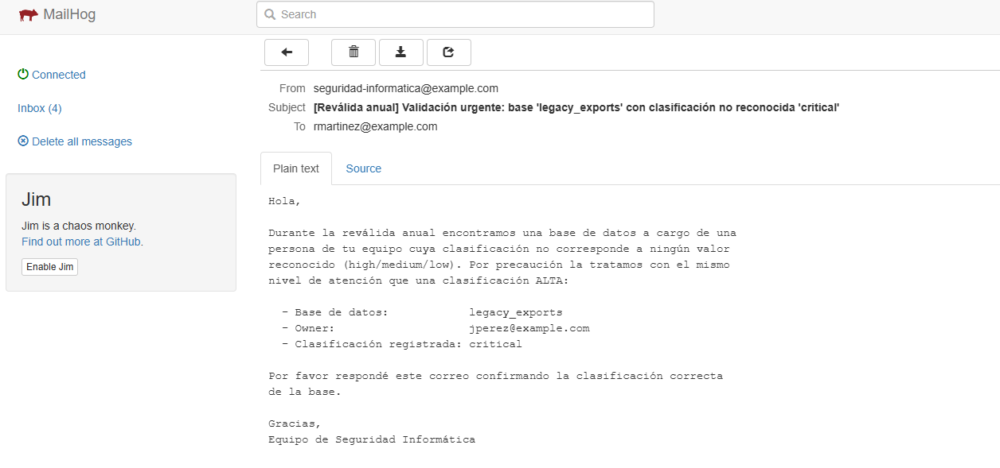
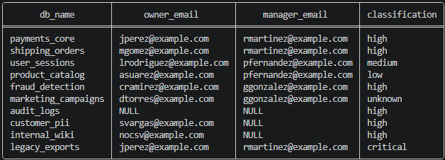
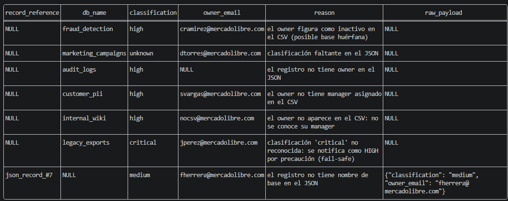

# DB Classification Revalidator


Aplicación que automatiza la **reválida anual de la clasificación de bases de datos**: ingesta la clasificación desde un archivo JSON y la relación usuario–manager desde un CSV, consolida todo en una base SQLite normalizada y **notifica por email a los managers** responsables de las bases críticas para obtener su aprobación, dejando cada hallazgo persistido y auditable.

> Desarrollada como solución al Challenge Desarrollo - JSON y CSV en Base de Datos


## ¿Qué hace la aplicación?

1. Lee un archivo **JSON** (`data/databases.json`) con la clasificación de las bases de datos, tolerando campos incompletos o inválidos.
2. Lee un archivo **CSV** (`data/users.csv`) con la relación usuario → manager (`row_id, user_id, user_state, user_manager`).
3. Cruza ambas fuentes y persiste todo en una base **SQLite normalizada**: por cada base queda su nombre, el email del owner, el email del manager y su clasificación.
4. Por cada base clasificada como **high** — o con una **clasificación no reconocida** (política fail-safe, ver más abajo) — envía un email al manager del owner pidiendo su aprobación.
5. Todo hallazgo que requiera atención humana queda **persistido en la base de datos**, no solo en el log.

## Herramientas y decisiones técnicas

| Herramienta | Para qué | Por qué se eligió |
|---|---|---|
| **Python 3.12** | Lenguaje de la aplicación | Lenguaje escogido. Toda la solución usa **solo la librería estándar**: `json` y `csv` (lectura de entradas), `sqlite3` (persistencia), `smtplib` + `email` (envío de correos), `logging` (trazabilidad) |
| **SQLite** | Base de datos | SQLite viene embebida en Python, no requiere servidor, y soporta todo lo necesario para la normalización: claves foráneas, restricciones UNIQUE, upserts y vistas. A parte de que se puede inspeccionar el resultado con un solo comando. |
| **MailHog** | Servidor SMTP de pruebas | Captura los correos "enviados" y los muestra en una interfaz web (http://localhost:8025). Permite demostrar el envío real por protocolo SMTP sin enviar correos a nadie. El código de envío es SMTP estándar: en adición para apuntar a un servidor real solo requiere cambiar dos variables de entorno. |
| **Docker + Docker Compose** | Empaquetado y orquestación  | Un solo comando levanta la aplicación y MailHog juntos, en cualquier máquina, sin instalar Python ni librerías. |
| **Git / GitHub** | Control de versiones  | Trazabilidad de cambios y entrega vía repositorio. |

## Ejecución con Docker 

```bash
docker compose up --build
```

Esto levanta dos contenedores:

- **MailHog** — abrir **http://localhost:8025** en el navegador para ver los emails enviados.
- **La aplicación** — procesa los archivos, carga la base y envía las notificaciones.

La base SQLite resultante queda en `./output/revalidation.db`.

### Cómo está construido el Dockerfile

```dockerfile
FROM python:3.12-slim        # Imagen oficial mínima: solo Python
WORKDIR /app
COPY src/ ./src/             # Código de la aplicación
COPY data/ ./data/           # Datos de entrada 
ENV DATA_DIR=/app/data \
    DB_PATH=/app/output/revalidation.db
RUN mkdir -p /app/output     # Directorio donde se escribe la base SQLite
CMD ["python", "src/main.py"]
```

Decisiones: se usa la variante **slim** para una imagen liviana; **no hay `pip install`** porque la aplicación no tiene dependencias externas (esto también elimina riesgos de supply chain); la configuración entra por **variables de entorno**, así el mismo contenedor sirve para cualquier entorno sin reconstruir.

### Cómo está construido el docker-compose

```yaml
services:
  mailhog:                     # SMTP de pruebas + interfaz web
    image: mailhog/mailhog:v1.0.1
    ports: ["8025:8025", "1025:1025"]
  app:
    build: .
    depends_on: [mailhog]      # La app arranca después que MailHog
    environment:
      SMTP_HOST: mailhog       # DNS interno de Compose: el servicio se
      SMTP_PORT: "1025"        # resuelve por su nombre dentro de la red
    volumes:
      - ./output:/app/output   # La base SQLite queda accesible desde el host
```

Dentro de la red de Compose los contenedores se resuelven **por nombre de servicio**, por eso `SMTP_HOST=mailhog` y no `localhost`. El volumen `./output` hace que la base de datos generada dentro del contenedor quede disponible en la máquina del evaluador.

## Ejecución local (sin Docker)

```bash
# 1. (Opcional) Levantar un SMTP de pruebas en otra terminal:
pip install aiosmtpd
python -m aiosmtpd -n -l localhost:1025

# 2. Ejecutar la aplicación:
python src/main.py
```

Si no hay servidor SMTP disponible, la aplicación **igualmente guarda todos los datos** y deja registrado en el log que los emails quedaron pendientes.

Variables de entorno: `SMTP_HOST` (default `localhost`), `SMTP_PORT` (default `1025`), `MAIL_FROM`, `DATA_DIR`, `DB_PATH`.

## Estructura del proyecto

```
├── data/
│   ├── databases.json   # Datos, con campos incompletos e inválidos.
│   └── users.csv        # Datos, con casos límite.
├── docs/
│   └── images/          # Capturas de la ejecución (MailHog y consultas)
├── src/
│   ├── main.py          # Orquestador del flujo
│   ├── readers.py       # Lectura y validación de JSON y CSV
│   ├── database.py      # Persistencia SQLite (esquema normalizado)
│   └── mailer.py        # Envío de emails vía SMTP (high + fail-safe)
├── Dockerfile
├── docker-compose.yml   # App + MailHog
└── README.md
```

## Diseño de la base de datos 

```
users                          databases                        review_flags
─────                          ─────────                        ────────────
id          PK                 id             PK                id           PK
email       UNIQUE             name           UNIQUE            database_id  FK → databases(id)
state                          classification                   reason
manager_id  FK → users(id)     owner_id       FK → users(id)    UNIQUE(database_id, reason)

manual_review_items
───────────────────
id               PK
record_reference + reason UNIQUE
db_name          (NULL permitido)
classification / owner_email
raw_payload      (registro JSON original completo)
```

- Cada persona (owner o manager) existe **una sola vez** en `users`; la relación owner → manager es una auto-referencia (`manager_id`).
- `databases` referencia a su owner por FK; el email del manager **no se repite** por registro, se obtiene navegando las relaciones.
- `review_flags` persiste los motivos de revisión manual de bases que sí existen en `databases` (una base puede tener varios motivos).
- `manual_review_items` persiste hallazgos **sin fila en `databases`** (ej.: un registro JSON sin nombre de base), guardando el `raw_payload` completo para que Seguridad lo revise sin depender del log.

**Tablas vs. vistas** — un punto importante del diseño: las cuatro tablas de arriba son las que **almacenan** datos. Las dos vistas (`revalidation_report` y `pending_manual_review`) no almacenan nada: son consultas guardadas. `revalidation_report` reconstruye la forma desnormalizada que pide el enunciado (base, owner, manager, clasificación), y `pending_manual_review` unifica con `UNION ALL` el contenido de `review_flags` y `manual_review_items` para consultar todos los casos de gestión manual en un solo lugar. Así se obtiene comodidad de consulta **sin duplicar datos**, que es justamente el objetivo de normalizar.

## Política fail-safe para clasificaciones no reconocidas

Se tomó en cuenta el concepto de fail-safe, este es un criterio de seguridad que dicta que ante una clasificación que no corresponde a ningún valor conocido (ej.: `"critical"`), hay dos opciones:

1. Tratarla como desconocida y **no notificar** (riesgo: si el valor era efectivamente más grave que `high`, una base crítica queda sin revalidar en silencio).
2. **Fail-safe**: ante la duda, asumir el escenario más restrictivo y notificar al manager igual que si fuera `high`, dejando explícito en el correo que la clasificación registrada no es válida y debe confirmarse.

Se eligió la opción 2, el principio clásico de seguridad de *fallar hacia el lado seguro*: el costo de un falso positivo es un correo de más; el costo de un falso negativo es una base potencialmente crítica sin revalidar. Además:

- El valor original (ej. `"critical"`) **se conserva tal cual en la base de datos** para trazabilidad.
- El correo fail-safe usa un asunto y cuerpo distintos, pidiendo confirmar la clasificación correcta.
- El caso queda también persistido en `review_flags`.
- Distinto es el caso de la clasificación **ausente** (campo faltante): ahí no hay ningún valor que validar, se guarda como `unknown`, no se notifica, y queda flag de revisión manual.

## Limitaciones y mejoras futuras

- **Verificación del OK**: un reply con "OK" no es una validación suficiente. No autentica al remitente (cualquiera con acceso al buzón puede responder, y el remitente de un correo es falsificable), no queda registrado en ningún sistema consultable y no permite hacer seguimiento de quién confirmó y quién no. 
- **Procesamiento de respuestas**: la aplicación envía las solicitudes pero no lee el buzón de respuestas; ese flujo (IMAP + actualización de estado) queda fuera del alcance del challenge.
- **Datos de prueba con dominio reservado**: los emails inventados usan `@example.com`, dominio reservado por el estándar RFC 2606 para documentación y pruebas, que nunca resuelve a buzones reales.
- **Referencias posicionales**: los hallazgos sin nombre de base se referencian por posición en el JSON (`json_record_#N`); con archivos que cambian de orden entre corridas convendría un hash del contenido del registro.

## Supuestos

1. **Datos inventados:** el enunciado indica inventar los datos. Ambos archivos incluyen casos incompletos, inválidos y límite para demostrar el manejo de errores.
2. **Emails no reales:** los datos inventados usan el dominio reservado `@example.com` y los correos se capturan en MailHog (o cualquier SMTP configurable por variables de entorno); nunca se envía nada a destinatarios reales.
3. **Identidad de usuarios:** `user_id` del CSV y `owner_email` del JSON son el mismo identificador (email corporativo).
4. **Idempotencia:** ejecutar la aplicación varias veces no duplica registros (upserts por claves únicas y restricciones UNIQUE en los flags).
5. **Persistir antes de notificar:** el guardado en base ocurre siempre antes del envío de correos; una falla del SMTP nunca pierde datos.

## Problemas encontrados y soluciones

| Problema | Decisión / Solución |
|---|---|
| Registros del JSON **sin nombre de base** | No se descartan: se guardan en `manual_review_items` con su `raw_payload` completo y aparecen en `pending_manual_review`. No se envía correo porque no hay base identificable que revalidar. |
| Registros del JSON **sin clasificación** (campo ausente) | Se guardan con clasificación `unknown`, no se notifica (no hay valor que validar) y quedan marcados para revisión manual. |
| Registros del JSON con **clasificación no reconocida** (ej. `"critical"`) | **Fail-safe**: se conserva el valor original en la base, se notifica al manager como si fuera `high` con un correo que pide confirmar la clasificación válida, y el caso queda en `review_flags`. |
| Owner que **no está en el CSV** o **sin manager asignado** | La base se guarda igualmente y se marca en `review_flags`; si requería notificación, el correo no puede enviarse y el caso queda auditado para que el equipo tome acción. Un dato faltante es una alerta, no algo que se descarta en silencio. |
| Owner en estado **`inactive`** en el CSV | El flujo continúa (el correo al manager se envía igual si corresponde), pero la base queda marcada como posible base huérfana: probablemente la persona ya no está en la empresa y hay que reasignar el owner. |
| Casos de gestión manual **solo visibles en el log** | El log es efímero: si nadie mira la consola, la alerta se pierde. Todos los casos anteriores se persisten en `review_flags` o `manual_review_items`, consultables en la vista `pending_manual_review`. |
| **Servidor SMTP caído** al ejecutar | La persistencia ocurre antes del envío: los datos nunca se pierden y el log indica que los correos quedaron pendientes de reenvío. |

## Datos de prueba y resultado esperado

Con los archivos incluidos (11 registros en el JSON, 8 usuarios en el CSV), la ejecución produce:

- **10 bases guardadas** en `revalidation_report` + **1 registro sin nombre** persistido en `manual_review_items` (nada se descarta).
- **4 emails enviados**: `payments_core`, `shipping_orders`, `fraud_detection` (high) y `legacy_exports` (fail-safe por clasificación `"critical"` no reconocida).
- **3 bases high sin destinatario** (owner ausente, sin manager, o fuera del CSV), auditadas para gestión manual.
- **7 casos en `pending_manual_review`**: owner inactivo (`fraud_detection`), clasificación faltante (`marketing_campaigns`), sin owner (`audit_logs`), registro sin nombre (`json_record_#7`), owner sin manager (`customer_pii`), owner fuera del CSV (`internal_wiki`) y clasificación no reconocida con fail-safe (`legacy_exports`).

### Vista esperada en MailHog

Inbox con los correos capturados:



Detalle de un correo normal por base clasificada como `HIGH`:



Detalle de un correo fail-safe por clasificación no reconocida:



### Consultas sobre el resultado

```bash
# La información que pide el enunciado:
sqlite3 output/revalidation.db "SELECT * FROM revalidation_report;"

# Casos pendientes de gestión manual:
sqlite3 output/revalidation.db "SELECT * FROM pending_manual_review;"
```

### Vista esperada de las consultas

Resultado de `revalidation_report`:



Resultado de `pending_manual_review`:


